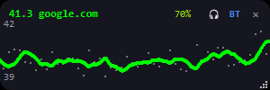
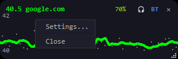
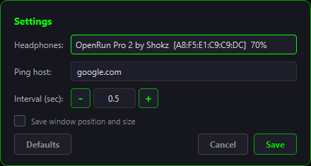

# PingWave

A lightweight, always-on-top desktop widget that displays a real-time ping graph with Bluetooth headphone monitoring.



## Features

- **Real-time ping graph** — continuously pings a configurable host and draws a smooth, color-coded latency graph
  - Green = low latency, Yellow = moderate, Red = high or lost packets
- **Bluetooth headphone monitoring** — shows connection status and battery level for paired Bluetooth audio devices
  - One-click connect / disconnect headphones
  - One-click Bluetooth radio on / off
  - Battery percentage with color gradient (green to red)
- **Frameless transparent overlay** — stays on top of all windows, blends into your desktop
  - Drag to move, scroll wheel to adjust opacity, corner grip to resize
- **Settings dialog** — right-click to configure everything without editing files

  
  

## Requirements

- Windows 10 / 11
- Python 3.11+

## Installation

1. Clone the repository:

   ```bash
   git clone https://github.com/Shtoong/PingWave.git
   cd PingWave
   ```

2. Create a virtual environment and install dependencies:

   ```bash
   python -m venv .venv
   .venv\Scripts\python.exe -m pip install -r requirements.txt
   ```

   Or simply run `run_pingwave.bat` — it will set up the environment automatically on first launch.

## Usage

### Quick start

Double-click **`run_pingwave.bat`** — the widget will appear in the top-left corner of your screen.

### Controls

| Action | How |
|---|---|
| Move window | Drag anywhere |
| Resize | Drag the bottom-right corner grip |
| Adjust opacity | Mouse wheel |
| Open settings | Right-click |
| Connect / disconnect headphones | Click the headphone icon |
| Toggle Bluetooth | Click "BT" |
| Close | Click "x" or press Esc |

### Settings

Right-click the widget and select **Settings...** to configure:

- **Headphones** — select a paired Bluetooth audio device from the dropdown (shows connection status and battery level)
- **Ping host** — the host to ping (default: `google.com`)
- **Interval** — ping interval in seconds (use +/- buttons to adjust)
- **Save window position and size** — check this to remember the current window geometry

Settings are saved to `config.toml` next to the application.

## Configuration

All settings can be managed through the Settings dialog. The config file (`config.toml`) is created automatically when you save settings for the first time.

Example:

```toml
[ping]
host = "google.com"
interval = 0.5
timeout = 1.0

[bluetooth]
device_name = "OpenRun Pro 2 by Shokz"
device_mac = "A8:F5:E1:C9:C9:DC"
poll_interval = 5
```

## How it works

- **Ping**: Uses [icmplib](https://github.com/ValentinBELYN/icmplib) with unprivileged sockets (no admin rights needed)
- **Bluetooth status**: WinRT APIs (`Windows.Devices.Bluetooth`, `Windows.Devices.Radios`) for connection status and radio control
- **Battery level**: Reads the standard Windows PnP device property (`DEVPKEY_Device_BatteryLevel`) from the HFP Bluetooth node via PowerShell
- **Connect / Disconnect**: Uses `BluetoothSetServiceState` (bthprops.cpl) to toggle A2DP and HFP service profiles
- **UI**: PySide6 (Qt6) with a frameless, transparent, always-on-top window and an offscreen QPixmap buffer for smooth graph rendering

## License

MIT
